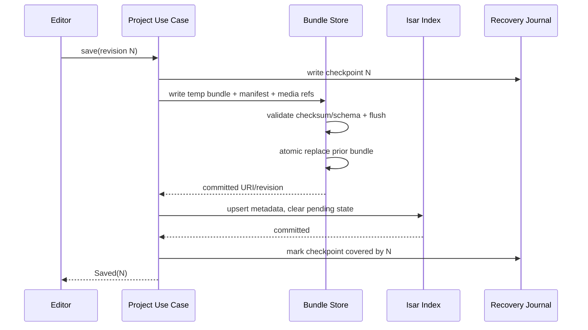
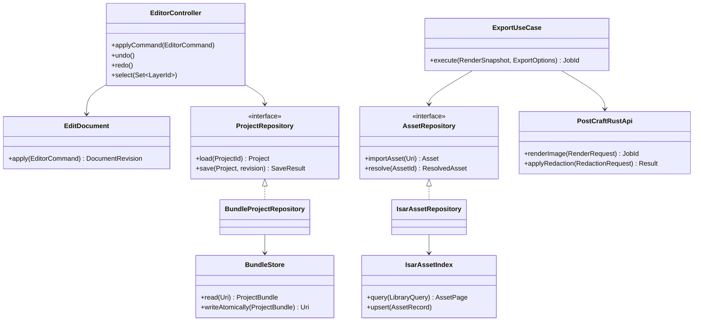
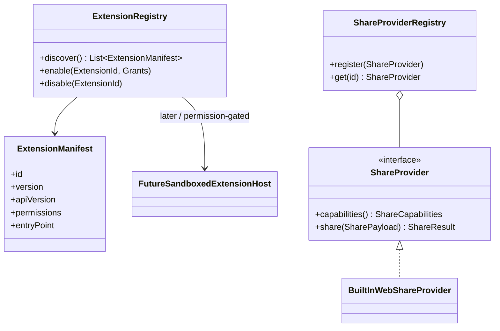

# PostCraft — Production Architecture & Product Specification

**Product:** PostCraft  
**Application ID:** `com.velstech.postcraft`  
**Document status:** Architecture baseline for implementation  
**Target:** Windows, Linux, macOS desktop; architecture permits later Android/iOS clients  
**Primary principle:** Capture locally, create quickly, export predictably. No account or network connection is required for core workflows.

---

## 1. Executive summary

PostCraft is a local-first desktop capture and content studio. Its product surface consists of a global capture launcher, a non-destructive annotation editor, a lightweight media timeline, a searchable local asset library, project/template workflows, and export/share destinations. The application is organized as a Flutter desktop shell and feature UI, with Rust owning latency-sensitive image/media/native operations through `flutter_rust_bridge` (FRB). Flutter owns interaction, orchestration, accessibility, and presentation. A repository boundary isolates Isar and filesystem persistence from domain logic.

The first production release is deliberately a cohesive screenshot workflow rather than a broad collection of incomplete tools: select a monitor/window/region, annotate, save a recoverable project, export to a preset, and copy the result to the clipboard. Recording, the library, timeline editing, social providers, and plugins build on the same asset/project/export contracts.

### Product goals

- Reach a useful capture-to-share result in seconds, with keyboard-first operation.
- Keep edits reversible and project files portable.
- Preserve original media and annotations; render only at explicit export boundaries.
- Maintain a responsive editor for 4K source images and 100 annotation/image objects.
- Work offline; make network sharing explicit, provider-based, and opt-in.
- Keep OS-specific capture and clipboard differences behind native adapters.

### Out of scope for the initial release

- Collaborative editing, hosted projects, or mandatory sign-in.
- CapCut-class effects, color grading, or multi-track professional audio post-production.
- Automatic upload to social accounts without a provider-specific authenticated flow.
- Arbitrary third-party native code execution in the plugin system.

---

## 2. Product requirements and acceptance boundaries

| Area | Production behavior / acceptance boundary |
|---|---|
| Region capture | Global shortcut opens a dimmed overlay on the selected display; pointer/keyboard selection, Escape cancel, Enter confirm; coordinates are mapped correctly across mixed DPI and multi-monitor layouts. |
| Full-screen capture | Capture selected display by default; offer all displays as a separate action. Respect OS capture permissions and report actionable errors. |
| Window capture | Enumerate capturable windows where the OS supports it. Window enumeration/capture is explicitly capability-gated per platform. |
| Delayed capture | Countdown is cancellable and does not block the editor; selection and countdown settings are configurable. |
| Annotation | Non-destructive ordered objects, selection, transforms, undo/redo, snapping, zoom/pan, and export-equivalent preview. A long-running raster operation never runs synchronously on the UI isolate. |
| Recording | Full-screen/region/window targets; mic/system/both where platform APIs permit; MP4/WEBM; display a capability matrix and permission state before starting. |
| Media studio | Single-project timeline with multiple ordered video/image/audio/text clips, trim/split/move, fades, volume, music, and deterministic FFmpeg render. No advanced VFX requirement. |
| Presets | Exact output dimensions listed in §8. Fit/fill behavior is visible and user-adjustable; do not silently distort content. |
| Quick Share | Copy rendered image/file, save, copy canonical path, and open provider share flows. Link generation is only available through an explicit configured provider; local-only mode must not imply that a link was created. |
| Projects | `.postcraft` project bundles include manifest and referenced media; save is atomic, recoverable, versioned, and portable. |
| Library | Indexed metadata in Isar; media bytes in managed local storage; searchable, taggable, filterable, and rebuildable from files. |
| Performance | Cold startup target <2 s on reference hardware; input-to-paint annotation latency p95 <16 ms; 60 FPS target; 100 objects and 4K source remain interactive. Heavy export/render work reports progress and is cancellable. |

### Feature availability is capability-based

Capture, window enumeration, system-audio loopback, global shortcuts, and clipboard APIs are not uniform across desktop operating systems. Every native service exposes `capabilities()` and structured unsupported/permission/temporary errors. UI controls are hidden or disabled with a reason when the target cannot be supported. Product documentation must not promise identical OS capabilities where the underlying OS does not provide them.

---

## 3. Architecture decisions

### 3.1 Runtime topology

```text
Flutter desktop process
 ├─ Presentation: Material 3 shell, editor canvas, panels, routing
 ├─ Feature application: Riverpod use-case orchestration
 ├─ Domain: entities, value objects, policies, repository contracts
 ├─ Data: Isar metadata, bundle/filesystem stores, DTO mapping
 └─ FRB client ─────────────────────┐
                                   ▼
Rust native/core library (FRB API)
 ├─ Capture adapters / coordinate conversion / permission status
 ├─ Image operations / thumbnails / image composition
 ├─ FFmpeg process supervision and render graph compilation
 └─ Native OS adapters (per-target implementation and capability flags)
                                   │
         OS capture/clipboard/window APIs + FFmpeg executable
```

Flutter remains the source of truth for interactive document state. Rust functions are stateless or own short-lived jobs; Rust does not maintain a second, unsynchronized annotation model. Large pixel buffers cross the bridge by file path or owned byte buffer only when justified by profiling. Prefer file-backed jobs and thumbnail-sized results over repeatedly copying full-resolution 4K buffers across FFI.

### 3.2 Architectural boundaries

- **Presentation** may depend on feature application APIs, design-system components, and Riverpod providers. It does not import Isar, OS packages, or FFmpeg process APIs directly.
- **Application** coordinates use cases and transactions. It depends on domain contracts, not platform libraries.
- **Domain** defines project, asset, annotation, timeline, export, and provider contracts. It has no Flutter, Isar, Rust-generated, or OS dependency.
- **Data/infrastructure** implements repositories, bundle storage, settings, and provider/native adapters. Mapping to persistence DTOs is explicit.
- **Rust core** exposes versioned, typed functions and streams through generated FRB bindings. Public bridge methods accept validated DTOs and return typed errors; panics must never cross the bridge.
- **Platform composition root** selects implementations and capabilities based on target OS. Feature code consumes interfaces.

### 3.3 Dependency direction

`presentation → application → domain ← data/infrastructure`  
`application → infrastructure ports (injected)`  
`Flutter adapters → generated FRB API → Rust core/platform adapters`

The composition root wires implementations. Keep each feature internally feature-first while sharing only true cross-feature contracts in `core/` and `shared/`.

### 3.4 Spike decisions (resolved)

1. **Isar desktop viability — RESOLVED, deferred.** `isar_generator 3.1.0+1` transitively pins `analyzer 5.13`, which cannot parse Dart 3.7+/3.12 source, and Isar 3.x is unmaintained; codegen is therefore not viable on the current toolchain. Per the interface-decoupling rule below, persistence is implemented behind `ProjectRepository` with an atomic file store; a maintained Isar or drift/SQLite implementation can be swapped in without touching domain or features. Media bytes are never stored in the index.
2. **Capture backend per OS — RESOLVED for Linux/GNOME.** GNOME Shell's private screenshot D-Bus API returns `AccessDenied` under Wayland policy, so capture uses the portable Freedesktop XDG Screenshot portal (desktop-controlled, Wayland-safe) via a Rust backend. Region and full-screen work when the portal is present; capabilities are reported truthfully and the UI disables capture otherwise. System-wide capture shortcuts use the XDG GlobalShortcuts portal, registered opt-in from Settings with a non-blocking bind and a background activation queue (never hangs on a consent dialog). Windows/macOS adapters remain follow-on.
3. **FFmpeg distribution/licensing:** decide whether to bundle, download with verified provenance, or use a system binary per installer and jurisdiction. Build and codec choices affect LGPL/GPL obligations. Ship an explicit notices/SBOM and codec capability probe; do not assume an arbitrary host `ffmpeg` exists. (Pending the timeline milestone.)
4. **FRB version — RESOLVED.** Codegen/runtime pinned to `2.13.0`; generated Dart bindings and `frb_generated.rs` are checked in and normalized with `cargo fmt`. Regenerating bindings (`flutter_rust_bridge_codegen`) must be followed by `cargo fmt --all` so the `--check` gate stays green.

---

## 4. Repository and folder structure

The following is the target monorepo layout. `generated/` files are generated and must identify their generator/version. Keep OS-specific implementation details in platform folders rather than branching through feature UI.

```text
postcraft/
├── apps/
│   └── desktop/
│       ├── lib/
│       │   ├── main.dart
│       │   ├── bootstrap/                 # init order, error handlers, DI composition
│       │   ├── app/                       # MaterialApp.router, theme, shell, route guards
│       │   ├── core/
│       │   │   ├── design_system/         # tokens, typography, icons, primitives
│       │   │   ├── errors/                # UI-safe error mapping
│       │   │   ├── routing/
│       │   │   ├── shortcuts/
│       │   │   ├── accessibility/
│       │   │   └── utils/
│       │   ├── shared/                    # reusable domain-neutral widgets/models
│       │   └── features/
│       │       ├── capture/{domain,application,data,presentation}/
│       │       ├── editor/{domain,application,data,presentation}/
│       │       ├── recording/{domain,application,data,presentation}/
│       │       ├── studio/{domain,application,data,presentation}/
│       │       ├── export/{domain,application,data,presentation}/
│       │       ├── sharing/{domain,application,data,presentation}/
│       │       ├── projects/{domain,application,data,presentation}/
│       │       ├── library/{domain,application,data,presentation}/
│       │       ├── templates/{domain,application,data,presentation}/
│       │       ├── settings/{domain,application,data,presentation}/
│       │       └── plugins/{domain,application,data,presentation}/
│       ├── test/                          # unit, widget, integration
│       └── pubspec.yaml
├── rust/
│   ├── Cargo.toml                         # workspace
│   ├── crates/
│   │   ├── postcraft_api/                 # FRB public API, DTOs, typed errors
│   │   ├── postcraft_capture/             # capture orchestration and backend traits
│   │   ├── postcraft_image/               # blur, pixelate, filters, composition
│   │   ├── postcraft_media/               # FFmpeg discovery, jobs, render graph
│   │   ├── postcraft_thumbnails/           # image/video/audio poster/waveform jobs
│   │   └── postcraft_platform/             # cfg-selected OS integrations
│   ├── bindings/                           # generated Dart/Rust bridge artifacts
│   └── tests/
├── resources/
│   ├── icons/ fonts/ templates/ presets/
│   └── ffmpeg/                             # packaging metadata; binaries per build pipeline
├── docs/
│   ├── architecture/ ADR/ security/ release/
├── scripts/                               # codegen, packaging, checks
├── Cargo.toml
├── melos.yaml                              # optional workspace orchestration
└── README.md
```

### Feature module conventions

```text
feature/
├── domain/
│   ├── entities/ value_objects/ repositories/ services/
├── application/
│   ├── use_cases/ state/                   # commands, queries, immutable state
├── data/
│   ├── datasources/ dto/ mappers/ repositories/
└── presentation/
    ├── pages/ widgets/ controllers/
```

Riverpod providers live with the layer they compose; a small app composition module exports overrides. Do not create a global `utils.dart` dumping ground.

---

## 5. Flutter application modules

### App shell and navigation

- `AppBootstrap`: initialize logging, paths, migrations, Isar, Rust library, capability discovery, then run the app. Defer nonessential library indexing until after first frame.
- `AppRouter`: Go Router routes and deep-link-safe internal navigation. Unsaved project edits are guarded on route changes and app shutdown.
- `WorkspaceShell`: resizable left navigation, central workspace, contextual right inspector, optional bottom timeline. Persist pane sizes and visibility per workspace.
- `CommandPalette`: searchable actions, recent projects, capture commands, and shortcuts.
- `ShortcutRegistry`: register only while app is active for editor-local keys; global keys are registered through `GlobalShortcutService`. Detect conflicts and let the user remap.
- `NotificationCenter`: transient success/progress/error messages, persistent job status, and actionable failures.

### Feature inventory

| Feature | Domain/application responsibilities | Presentation responsibilities |
|---|---|---|
| Capture | Capture target, delay, capability, permission and result use cases | Overlay, monitor/window chooser, countdown, keyboard selection affordances |
| Editor | Document operations, selection, transforms, history, snapping, render/export snapshot | Canvas, tool rail, object handles, zoom/pan, inspector, history controls |
| Recording | Session configuration, start/stop lifecycle, output asset | Target/audio chooser, permission messaging, recording HUD/timer |
| Studio | Track/clip edits, timeline validation, render-job request | Tracks, waveform/poster strips, trim handles, playhead, preview |
| Export | Preset/layout policy, render request, validation | Export dialog, dimension/format/quality, progress/cancel |
| Sharing | Provider contract, share intent and result | Destination chooser, local actions, provider-specific handoff |
| Projects | Create/open/save/autosave/recovery and bundle validation | Recent projects, save state, recovery prompt, project details |
| Library | Index query, tags, favorites, import/delete policies | Search, filters, grid/list, preview, drag-insertion |
| Templates | Template catalog and application to a project | Template browser and preview |
| Settings | Preferences, shortcut map, storage/FFmpeg/capability status | Settings sections and diagnostics |
| Plugins | Manifest discovery and permissioned extension lifecycle (later) | Installed/available plugin manager and grants (later) |

---

## 6. UX specification and wireframes

### Visual direction

- Dark-first surfaces, warm neutral canvas background, high-contrast typography, restrained accent gradient, and translucent/glass treatment only for floating overlays and command surfaces.
- Material 3 semantics and keyboard/focus behavior; custom desktop density, window controls, hover states, and resize affordances. Glass effects must degrade gracefully and never sit behind dense controls.
- Motion is purposeful: 120–180 ms for pane/menu transitions, 180–240 ms for modal/selection emphasis; honor reduced-motion settings.
- 8 px spacing grid, 4 px fine grid, 10–12 px control radius, visible focus ring, tooltips with shortcuts, minimum 4.5:1 text contrast.
- Avoid persistent modal workflows. Capture, import, export, and quick-share should remain recoverable and show job state.

### Main workspace wireframe

```text
┌───────────────────────────────────────────────────────────────────────────┐
│ PostCraft  [Project name · Saved]                  Search   Share   — □ × │
├───────────┬───────────────────────────────────────────────┬───────────────┤
│ + Capture │                                               │ Properties    │
│ Projects  │                  EDITOR CANVAS                │ Selection     │
│ Library   │      zoom/pan · guides · transparent grid     │ Position      │
│ Templates │                                               │ Size          │
│           │                                               │ Fill / stroke │
│           │                                               │ Arrange       │
│ Settings  │                                               │ Accessibility │
├───────────┴───────────────────────────────────────────────┴───────────────┤
│ Tool rail: Select  Arrow  Shape  Text  Marker  Blur  Crop  Undo  Redo     │
├───────────────────────────────────────────────────────────────────────────┤
│ Timeline (when project contains media)     ◀  Play  ▶   00:00 / duration  │
│ V1  [image / video clip.................................]                 │
│ A1  [audio waveform.....................................]                 │
└───────────────────────────────────────────────────────────────────────────┘
```

The timeline is collapsed/absent for a screenshot-only document. On smaller windows, the inspector and timeline become collapsible panes; the canvas retains priority. Tool-specific properties replace generic inspector sections.

### Capture overlay wireframe

```text
┌──────────────────────────── dimmed desktop / selected display ────────────┐
│                         ┌─────────────────────┐                            │
│                         │ live selection      │                            │
│                         │  x/y · w/h          │                            │
│                         └─────────────────────┘                            │
│   Esc Cancel     Enter Capture     Shift drag: square     Space: move      │
└───────────────────────────────────────────────────────────────────────────┘
```

Overlay must show a crisp magnifier/crosshair when precision is useful, never obscure the selection boundary, and use physical-pixel conversion to avoid mixed-DPI drift.

### Capture-to-export interaction flow

1. Trigger shortcut or Capture button; choose Region, Display, Window, Delay, or Recording.
2. Select target; verify audio/capture permissions where needed.
3. Receive capture as a new project document or asset according to the user's “open in editor” preference.
4. Annotate with explicit tool state, handles, undo/redo, and continuously saved recovery checkpoint.
5. Export via preset/format and optional crop/layout adjustments.
6. Show result actions: Copy, Save, Copy Path, Open in provider. A share link action is shown only when a configured link provider is available.

### Core routes

```text
/workspace
/projects
/projects/:projectId
/library
/templates
/settings/:section
/capture (transient route/state; overlay may be native)
/export/:projectId
```

---

## 7. Domain model and database schema

### 7.1 Domain entities

Identifiers are opaque UUIDs. Persist UTC timestamps in ISO-8601/UTC form or integer epoch micros consistently. Geometry is logical document-space units; source media dimensions and monitor coordinates retain explicit pixel/DPI metadata.

```text
Project
  id, name, createdAt, updatedAt, schemaVersion, bundleUri, thumbnailAssetId?
  documentIds[], assetIds[], tags[], templateId?, recoveryState

Document
  id, projectId, kind(image|video|audio|composition), width, height, frameRate?
  colorSpace, durationMs?, background, layerIds[], trackIds[], revision

Asset
  id, kind(image|video|audio|gif|other), originalName, mimeType, extension
  contentHash(sha256), byteSize, sourceUri, managedUri, width?, height?
  durationMs?, frameRate?, audioChannels?, sampleRate?, createdAt, importedAt
  thumbnailUri?, waveformUri?, metadataJson, availability

Layer (discriminated union)
  id, documentId, type(image|shape|text|marker|blur|pixelate|emoji|video|audio)
  name, visible, locked, opacity, blendMode, transform, zIndex, assetId?
  payload(type-specific), mask?, createdAt, updatedAt

Transform
  x, y, width, height, rotationRadians, anchorX, anchorY, flipX, flipY

Annotation payloads
  Arrow/Line: points[], strokeColor, strokeWidth, arrowHead
  Shape: rect|roundedRect|ellipse, fill?, stroke, radius?
  Text: text, fontFamily, fontSize, weight, alignment, lineHeight, color, background?
  Freehand: points[{x,y,pressure?,time?}], brush, color, width, opacity
  Redaction: region, mode(blur|pixelate|solid), strength, blockSize
  Step: number, label, fill, textColor
  Emoji: unicodeOrAssetId, font/asset scale
  Crop: sourceRect (non-destructive until export)

TimelineTrack
  id, documentId, kind(video|audio|overlay), name, order, muted, solo, gain

TimelineClip
  id, trackId, assetId?, layerId?, kind, startMs, sourceInMs, sourceOutMs
  transform?, volume, fadeInMs, fadeOutMs, title?, effects[], transitionToNext?

ExportPreset
  id, label, width, height, fitPolicy, safeArea?, defaultFormat, quality

RenderJob
  id, projectId, operation, state(queued|running|cancelling|succeeded|failed|cancelled)
  progress, outputUri?, errorCode?, errorMessage?, startedAt?, completedAt?

Tag(id, label, color), AssetTag(assetId, tagId), RecentItem(id, entityId, kind, openedAt)
Preference(key, typedValue, updatedAt), RecoveryJournal(projectId, revision, checkpointUri)
```

Layer and clip payloads are typed/versioned values, not unvalidated arbitrary JSON in domain APIs. Persistence DTOs may use JSON for forward-compatible payload storage, but validate and migrate them at repository boundaries.

### 7.1.1 Annotation tool contract

| Tool | Document operation and interaction |
|---|---|
| Select / Object Selection | Click selects the topmost hit-tested object; Shift-click toggles membership; marquee selects intersecting/contained objects by explicit mode. Escape clears selection. Locked/hidden objects are excluded from normal hit testing. |
| Arrow / Line | Drag creates a segment; modifier keys constrain angle; endpoints and stroke remain editable. Arrow-head style is part of the layer payload. |
| Rectangle / Rounded Rectangle / Circle | Drag defines bounds; modifier constrains a square/circle; fill and stroke are independently configurable. Rounded radius is clamped to bounds. |
| Text | Click/drag creates text bounds and enters inline editing; font, size, weight, alignment, line height, color, and background are inspector properties. Text editing commits as one undoable command. |
| Highlighter / Marker / Pencil | Pressure-aware freehand when device input provides pressure; otherwise stable pointer sampling. Highlighter uses a translucent blend mode; marker is opaque with rounded caps; pencil preserves editable sampled points. Simplification must retain visual tolerance and undo fidelity. |
| Blur / Pixelate | Drag or resize a redaction region. Strength/block size are adjustable. Preview is source-backed and cached; final output recomputes from original pixels to avoid leaking detail through a blurred preview. |
| Numbered Steps | Click places a numbered badge; automatic numbering follows document order and can be manually overridden. Renumbering is deterministic and undoable. |
| Emoji | Search/select Unicode or bundled emoji asset; preserve text fallback where possible and package bundled assets/fonts needed for portability. |
| Crop | Resize a non-destructive document viewport/source crop; allow reset and aspect-ratio constraints. Apply-at-export uses the same crop policy as preview. |
| Zoom / Pan | Viewport-only interaction; zoom anchors at pointer position, supports fit/100%/selection, and never changes document content or undo history. |
| Color Picker | Sample rendered source/composite at document coordinate and copy the color value; sampling is read-only and follows an explicit alpha/color-space policy. |

All document mutations are commands with undo/redo and a revision. Layer order controls stacking; inspector arrange actions include front/back/forward/backward and align/distribute. Resize handles expose accessible labels and keyboard nudging. Snapping uses canvas edges/centers, selected object edges/centers, and optional grid; show guides during the gesture and do not persist guide lines as artwork. For a gesture, coalesce pointer updates into one command on commit so high-frequency samples do not create hundreds of history entries.

### 7.1.2 Capture and recording request contract

Capture requests identify `targetKind` (`region`, `display`, `allDisplays`, `window`), a stable target ID where applicable, countdown duration, and requested cursor inclusion. Region coordinates carry display ID, logical bounds, and physical bounds/DPI scale. Results include file/bytes ownership, dimensions, color metadata, cursor policy, and capture timestamp. Topology changes invalidate stale target IDs and require target refresh rather than capture against old coordinates.

Recording configuration includes target, container (`mp4` or `webm`), frame-rate policy, microphone source ID, system-loopback source ID, and an explicit audio selection (`none`, `microphone`, `system`, `both`). The OS adapter reports device availability and permission state before start. Session state is `requesting → recording → stopping → completed|failed|cancelled`; stopping twice is idempotent. Region capture records the selected physical rectangle and handles display removal as a structured failure. Recording HUD controls remain outside the captured region where possible, with a user-configurable countdown and stop shortcut.

### 7.2 Isar collections / indexes

Use the following logical collections; exact Isar annotations depend on the pinned Isar release and generated model constraints.

| Collection | Primary/index strategy |
|---|---|
| `ProjectRecord` | Unique `id`; index `updatedAt`, `name` (case-normalized search key), `bundleUri` |
| `AssetRecord` | Unique `id`; index `kind`, `createdAt`, `contentHash`, `availability`; composite/search indexes for normalized name and metadata keywords |
| `TagRecord` | Unique `id`; unique normalized `label` |
| `AssetTagRecord` | Unique `(assetId, tagId)`; index both keys |
| `RecentRecord` | Unique `id`; composite `kind, openedAt`; index `entityId` |
| `PreferenceRecord` | Unique `key` |
| `RecoveryRecord` | Unique `projectId`; index `updatedAt`, `state` |
| `JobRecord` | Unique `id`; index `state, createdAt`, `projectId` |

Project documents/layers/timeline are stored in the `.postcraft` bundle manifest as versioned project data; Isar stores catalog metadata and recovery/job state. This avoids split-brain edits between database records and a portable project bundle. Writes to index metadata follow a successful bundle commit (or record a repairable pending operation). Media payloads live in project bundle storage or app-managed asset storage, never as multi-megabyte Isar fields.

### 7.3 File locations and bundle format

Use platform application-support/cache directories (resolved via a path provider) rather than hard-coded paths:

```text
<app-support>/PostCraft/
  database/                 # Isar files
  assets/sha256/<prefix>/<hash>.<ext>
  thumbnails/<asset-id>/<size>.webp
  waveforms/<asset-id>.json
  recovery/<project-id>/<revision>.journal
  jobs/<job-id>/
  logs/
```

`.postcraft` is a ZIP-compatible, versioned bundle:

```text
manifest.json               # formatVersion, project, docs, layers, timeline, assets
media/<asset-id>.<ext>       # embedded originals or explicitly bundled proxy media
previews/thumbnail.webp
```

Import validates archive paths, entry count, declared/uncompressed sizes, checksums, and schema before extraction. Reject path traversal and duplicate manifest IDs. Saving writes a sibling temporary file, fsyncs where supported, validates the new bundle, then atomically renames; retain the last valid bundle until commit succeeds. Autosave uses a debounced journal/checkpoint and does not rewrite the full bundle on every pointer movement. “Package project” embeds media; normal project work can reference managed assets, with an explicit portable-copy operation.

### 7.4 Migration/recovery policy

- Keep independent `dbSchemaVersion` and `bundleFormatVersion`.
- Migrations are sequential, idempotent where possible, and tested with real prior-version fixtures.
- Never silently discard unknown fields; preserve opaque forward-compatible data where safe and reject unsupported major bundle versions with an exportable diagnostic.
- On unclean shutdown, recover from the latest valid journal; present recovered/last-saved choices and retain original files until the user confirms cleanup.
- A missing asset is represented as unavailable, not removed from the document; provide relink/search actions.

---

## 8. Social presets, export, and sharing

### Preset catalogue

| Preset | Canvas |
|---|---:|
| LinkedIn Post | 1200 × 627 |
| Twitter/X | 1600 × 900 |
| Instagram Post | 1080 × 1350 |
| Instagram Story | 1080 × 1920 |
| YouTube Thumbnail | 1280 × 720 |
| Facebook Post | 1200 × 630 |

Applying a preset changes the composition canvas and offers **Fit** (letterbox with background), **Fill** (crop overflow), or **Stretch** only with explicit warning. Preserve original composition and create an undoable document operation. Render at requested dimensions with color-profile handling, alpha policy, and image format/quality visible in export settings.

### Export pipeline

1. Validate project/document and resolve local assets.
2. Freeze a revisioned immutable render snapshot.
3. Compile to an operation graph (Flutter preview and Rust export use matching geometry/style semantics).
4. Render on Rust worker threads; stream progress/cancellation.
5. Validate output dimensions, format, readability, and nonzero content; atomically write destination.
6. Register output in the library only after success; execute requested clipboard/provider action.

PNG is the fidelity/alpha default for screenshots; JPEG/WebP options are explicit. Video exports use selected MP4 or WEBM profile with codec capability checks. Metadata stripping is the privacy-preserving default for exported screenshots, with an opt-in retain-metadata preference.

### Sharing provider contract

```dart
abstract interface class ShareProvider {
  String get id;
  String get displayName;
  ShareCapabilities get capabilities;
  Future<ShareResult> share(SharePayload payload, ShareContext context);
}
```

Targets: X, LinkedIn, Facebook, Reddit, Discord, Telegram, WhatsApp. Providers may hand off to an HTTPS compose URL, OS share target, or authenticated API only when a supported documented flow exists. Do not claim a post was published when the provider merely opens a compose screen. Provider result differentiates `opened`, `copied`, `uploaded`, `published`, `cancelled`, and `failed`.

“Generate Share Link” requires a separately configured `LinkProvider` with explicit destination, retention/expiry, upload confirmation, and deletion policy. Local-only builds omit or disable link generation. Future provider secrets use OS secure storage, never Isar/plain preferences.

---

## 9. Rust responsibilities and API boundaries

### Crate responsibilities

| Crate | Responsibilities |
|---|---|
| `postcraft_api` | FRB-exposed request/response DTOs, function facade, error translation, job stream IDs |
| `postcraft_capture` | Capture lifecycle, display/window target normalization, overlay geometry messages, screenshot result ownership |
| `postcraft_image` | High-quality blur, pixelation/redaction, color filters, composite/raster export, color and bounds validation |
| `postcraft_media` | FFmpeg discovery/version probe, argument construction, render graph, subprocess supervision, progress and cancellation |
| `postcraft_thumbnails` | Image/video poster frames, audio waveform/metadata, bounded queue/cache |
| `postcraft_platform` | `cfg(target_os)` native capture/clipboard/window/audio adapters and capability report |

### Bridge surface (logical API)

```text
get_runtime_info() -> RuntimeInfo
get_capabilities() -> PlatformCapabilities
list_capture_targets() -> CaptureTargetList
capture(request) -> CaptureResult
start_recording(request) -> RecordingSessionId
stop_recording(sessionId) -> CaptureResult
cancel_operation(operationId) -> Unit
apply_redaction(request) -> ImageOperationResult
render_image(request) -> RenderJobId
render_timeline(request) -> RenderJobId
generate_thumbnail(request) -> ThumbnailResult
watch_job(jobId) -> Stream<JobEvent>
```

All requests include operation IDs, dimensions/limits, and cancellation semantics where relevant. Validate coordinates, paths, dimensions, and enum values before allocation or process launch. Bridge errors have stable `code`, safe `message`, optional `detail`, and `recoverable` fields. Logs may include IDs and timings, not screenshot/media contents.

### Annotation renderer contract

The Flutter canvas owns interactive vector preview for low-latency gesture feedback. Blur/pixelation effects render from source-backed regions via cached textures/tiles; only affected regions are recomputed after a change. Rust owns final full-resolution raster compositing, filters, thumbnails, and timeline rendering. The geometry, color, alpha, font metrics policy, and blend mode semantics are specified once in versioned render DTOs and validated by golden tests across both previews and exports.

---

## 10. FFmpeg integration strategy

### Process and packaging

- Run FFmpeg as a supervised child process rather than a long-lived in-process multimedia ABI initially; this limits ABI, crash, and licensing coupling.
- Resolve executable using packaged location first, then explicitly configured/system location. Probe version and required encoders/muxers on startup in background; show missing capability diagnostics in Settings.
- Pin/test known FFmpeg builds per platform/architecture. Record build configuration, license, codec list, and source provenance in release artifacts. Validate distribution obligations with legal review before shipping binaries.
- Construct `Command` arguments as an argv list; never concatenate user text into a shell command or invoke a shell. Use generated safe temporary paths and controlled environment.
- Capture stdout/stderr without unbounded memory; parse machine-readable `-progress pipe:1` where available; redact sensitive paths in diagnostics.

### Render graph

Domain timeline → validate asset references and time ranges → normalize graph (track order, clip ranges, fades, gain, overlays) → create FFmpeg filter graph and input map → render to temporary file → probe/validate → atomic output move. Use `ffprobe` or equivalent bundled probing to inspect source streams. For images, Rust image processing can render locally without FFmpeg; FFmpeg is used for video/audio/GIF conversions and timeline output.

### Audio/video behavior

- Discover codecs/containers at runtime; map MP4 to an approved H.264/AAC profile when present, WEBM to VP9/Opus where supported; allow tested fallback encoders and explain quality/performance changes.
- Convert all clip times to a single integer microsecond/time-base representation; clamp source in/out and handle zero-length clips as validation errors.
- Mix mic/system audio according to captured tracks and explicit permissions. Use OS-native audio sources, not assumptions that FFmpeg alone can capture desktop audio.
- Audio fades/gain and video fades/transforms are encoded as deterministic filters. Keep a small render-graph versioned serializer for reproducibility.
- Support cancellation by terminating the child process tree, cleaning temporary artifacts, and marking the job `cancelled`; handle app shutdown with a bounded graceful-stop period.
- Render to a temporary destination on the same filesystem as the final output when possible; verify output before atomic rename.

### Resource management

Limit concurrent heavy jobs (initially one video render, configurable bounded image jobs); use a job queue with progress and priority. Estimate disk requirement before export. Preserve originals and clean only known PostCraft temporary directories according to age/state. Proxy generation for large video previews is a later optimization; first release must keep screenshot annotation responsive while exports execute.

---

## 11. Riverpod providers and Go Router composition

Use code-generated Riverpod providers where useful and pin the generator conventions. Keep mutable editor state scoped by project/editor route so closing a document releases large image buffers.

```dart
// Application composition (conceptual provider inventory)
final appPathsProvider = Provider<AppPaths>(...);
final isarProvider = FutureProvider<Isar>(...);
final rustApiProvider = Provider<PostCraftRustApi>(...);
final platformCapabilitiesProvider = FutureProvider<PlatformCapabilities>(...);

final projectRepositoryProvider = Provider<ProjectRepository>(...);
final assetRepositoryProvider = Provider<AssetRepository>(...);
final captureRepositoryProvider = Provider<CaptureRepository>(...);
final exportRepositoryProvider = Provider<ExportRepository>(...);
final shareProviderRegistryProvider = Provider<ShareProviderRegistry>(...);

final recentProjectsProvider = FutureProvider<List<ProjectSummary>>(...);
final libraryQueryProvider = FutureProvider.family<AssetPage, LibraryQuery>(...);
final captureControllerProvider = AsyncNotifierProvider<CaptureController, CaptureState>(...);
final editorControllerProvider = NotifierProvider.family<EditorController,
    EditorState, ProjectId>(...);
final editorHistoryProvider = Provider.family<EditorHistory, ProjectId>(...);
final renderJobsProvider = StreamProvider<List<RenderJob>>(...);
final renderJobProvider = StreamProvider.family<RenderJob, JobId>(...);
final timelineControllerProvider = NotifierProvider.family<TimelineController,
    TimelineState, DocumentId>(...);
final settingsControllerProvider = AsyncNotifierProvider<SettingsController,
    AppSettings>(...);
```

Provider rules:

- Repositories are app-scoped and immutable; editor/timeline state is document-scoped.
- Use `AsyncValue` for IO state and explicit domain states for capture/render lifecycle.
- Do not expose mutable Isar objects to widgets. Map to immutable domain/read models.
- Debounce search and autosave; use `select`/small derived providers to minimize canvas rebuilds.
- Keep gesture samples local to the canvas/controller and commit one undoable command at gesture completion, not one state notification per pointer event.
- Persist history checkpoints only when appropriate; undo stack is in-memory between durable document revisions.

---

## 12. Sequence diagrams

### 12.1 Region capture, edit, clipboard

```mermaid
sequenceDiagram
  actor User
  participant Hotkey as ShortcutRegistry
  participant Capture as CaptureController
  participant Native as Rust Capture API
  participant OS as Desktop OS
  participant Project as ProjectRepository
  participant Editor as EditorController
  participant Export as ExportController
  participant Clipboard as ClipboardService
  User->>Hotkey: Ctrl+Shift+A
  Hotkey->>Capture: beginRegionCapture()
  Capture->>Native: listCaptureTargets()
  Native->>OS: displays / capabilities
  OS-->>Native: target metadata
  Native-->>Capture: targets + capability flags
  Capture->>OS: show selection overlay (platform adapter)
  User->>Capture: drag region + confirm
  Capture->>Native: capture(target, physicalBounds)
  Native->>OS: capture selected display/window
  OS-->>Native: image bytes or owned temp file
  Native-->>Capture: CaptureResult + metadata
  Capture->>Project: create project + asset + initial document
  Project-->>Editor: ProjectId / DocumentId
  Editor-->>User: editor opens; autosave checkpoint scheduled
  User->>Editor: add/adjust annotations
  Editor->>Project: commit document revision
  User->>Export: Export PNG
  Export->>Native: render immutable snapshot
  Native-->>Export: validated output file
  Export->>Clipboard: copy image bytes/file representation
  Clipboard-->>User: success or actionable OS error
```

### 12.2 Timeline export with cancellation

```mermaid
sequenceDiagram
  actor User
  participant UI as Timeline UI
  participant App as Export Use Case
  participant Repo as Asset/Project Repositories
  participant Rust as FFmpeg Job Supervisor
  participant FFmpeg
  User->>UI: Export MP4
  UI->>App: renderTimeline(projectRevision, options)
  App->>Repo: resolve assets + freeze snapshot
  Repo-->>App: validated immutable render graph
  App->>Rust: start job(graph, destination)
  Rust->>FFmpeg: spawn argv + filter graph
  loop progress
    FFmpeg-->>Rust: progress records
    Rust-->>UI: job event stream
  end
  alt User cancels
    User->>UI: Cancel
    UI->>Rust: cancel(jobId)
    Rust->>FFmpeg: terminate process tree
    Rust-->>UI: cancelled + temp cleanup
  else Render succeeds
    FFmpeg-->>Rust: exit code 0
    Rust->>Rust: probe and validate output; atomic rename
    Rust-->>UI: succeeded(output asset)
  end
```

### 12.3 Save/recovery transaction



---

## 13. Class / component diagrams

### 13.1 Clean architecture and repository boundary



### 13.2 Plugin/provider boundaries



---

## 14. Plugin architecture (Release 5)

Plugins must not execute arbitrary native Rust or Dart code inside the main process. Initial extension model is a versioned declarative manifest plus sandboxed WASM or isolated subprocess host, with a narrow capability RPC. The first practical plugin points are export formats/templates, share destination adapters, importers, and editor commands that operate on documented project DTOs.

### Manifest

```json
{
  "id": "org.example.postcraft.sample-exporter",
  "name": "Sample Exporter",
  "version": "1.0.0",
  "apiVersion": "1",
  "entryPoint": "plugin.wasm",
  "permissions": ["project.read", "export.write"],
  "capabilities": ["exporter"],
  "publisher": "Example"
}
```

### Lifecycle/security boundaries

- Validate signature/hash, manifest schema, API version, package limits, and permission declarations before enablement.
- Grant least privilege; project read, file export, network access, clipboard access, and credential access are separate capabilities. Network is denied by default.
- Run with memory, CPU/time, output size, and filesystem quotas; only expose granted virtual files and host functions.
- Require explicit user confirmation for installation and each new permission; show publisher and capability changes on update.
- Version plugin API independently; deprecate with compatibility windows; disable incompatible plugins safely.
- Keep plugins unavailable until the host sandbox, permission model, and review/update mechanism are implemented and tested.

---

## 15. Security, privacy, and reliability

- Core operation is offline and project data remains local by default. No telemetry or content upload without explicit, documented opt-in.
- Validate imported archive paths, media dimensions, codec metadata, decompression limits, SVG/image parsing, and malformed project payloads. Treat media as untrusted input.
- Use app-private storage permissions and secure OS credential storage for any future provider tokens.
- Clipboard writes are user-triggered. Do not read clipboard contents during startup or background polling.
- Do not log image/audio/video contents, access tokens, or private metadata; sanitize file paths from diagnostic bundles unless user explicitly includes them.
- Use Rust checked arithmetic and allocation caps for dimensions/region bounds; fuzz parsers and FFI validation. Catch/report Rust panics at the bridge boundary.
- Isolate render jobs from UI state; job failure/cancellation must not corrupt the source project. Keep temp files in known job-scoped directories.
- On native permission loss or external file deletion, transition state and offer recovery, relink, or retry rather than silently dropping content.
- Supply crash diagnostics and an exportable support bundle with user review before it leaves the machine.

---

## 16. Performance and quality budgets

These are release targets, measured on declared reference hardware and representative source assets, not unqualified guarantees for every machine.

| Measure | Target / implementation strategy |
|---|---|
| Cold launch | p95 <2 s to interactive workspace on reference device; delay thumbnails/index scan/FFmpeg probe until after first frame. |
| Annotation gesture | p95 input-to-paint <16 ms at 60 Hz; no database IO or full-resolution filter work in pointer callback. |
| Editor scene | 100 vector/image objects remain 60 FPS at common viewport; spatial culling, repaint boundaries, cached paths, immutable snapshots. |
| 4K screenshot | Decode/resample preview appropriately; preserve source; tiled/cached region effects and background export. |
| Memory | Bound decoded image cache and thumbnail cache; evict by LRU and release document resources on close. Define per-platform budgets after profiling. |
| Search | Debounced query, indexed metadata, paginated results; avoid scanning file bytes at query time. |
| Video export | Progress, cancel, no UI-thread work; job concurrency limit and disk estimate. Performance target measured per profile/codec. |
| Startup failure | Isar migration failure or Rust load failure has a recovery/diagnostic path; library scan failure does not prevent workspace launch. |

Instrument durations, dropped frames, render-job throughput, and error codes. Keep content, names, and file paths out of metrics unless the user opts into a diagnostic bundle.

---

## 17. Testing and release strategy

### Test pyramid

1. **Domain unit tests:** geometry, snapping, crop policies, timeline ranges, clip split/trim, preset fit/fill, migrations, undo/redo invariants, and provider result states.
2. **Flutter unit/widget tests:** tool activation, inspector edits, selection/handles, keyboard shortcuts, autosave status, route guards, responsive panes, accessibility semantics, and theme states.
3. **Repository integration tests:** Isar queries/migrations, bundle round trips, atomic save interruption, checksum handling, missing assets, tags/search, and recovery journal replay.
4. **Rust unit/property/fuzz tests:** coordinate conversion, bounds/allocation validation, blur/pixelate boundaries, image filter semantics, FFmpeg argv generation, progress parsing, cancellation, archive/parser DTO validation.
5. **Golden tests:** annotation composition and preset output across representative fonts, DPI, alpha, rotation, and redaction; compare Flutter preview policy to Rust render output within documented tolerances.
6. **Native integration tests:** monitor enumeration/capture, mixed-DPI coordinates, global shortcut registration/conflict, clipboard, permission states, window capture, mic/system audio, child-process cancellation on each supported OS.
7. **End-to-end workflows:** capture → annotate → save/reopen → export → clipboard; recovery after forced exit; import/unavailable asset repair; timeline render/cancel.
8. **Performance tests:** cold launch, 4K load, 100-object pan/zoom/edit, 60 Hz pointer traces, thumbnail queue saturation, large export. Record hardware/OS/codec baseline.

### CI gates

- Flutter format/analyze/test; Rust fmt/clippy/test; FRB generation diff check; Isar codegen check; dependency/license scan; secret scan; platform compile checks.
- Build signed/reproducible packages for Windows, Linux, macOS architectures selected for release; smoke-test install, permissions, update/upgrade, uninstall data retention policy.
- Bundle-format compatibility fixtures and release candidate data migration tests are blocking checks.
- SBOM and FFmpeg notices accompany installers. Signing/notarization handled by protected release pipeline secrets.

### Definition of done for a feature

Acceptance behavior and capability states are implemented; domain and failure paths tested; keyboard/accessibility behavior documented; no unbounded work on UI isolate; logs are privacy-safe; migration or project-format impact is reviewed; platform coverage is explicitly reported; docs and telemetry budget updated.

---

## 18. Feature roadmap and development milestones

### Release plan (aligned to the requested phases)

| Release | Scope | Exit criteria |
|---|---|---|
| **R1 — Capture & Create** | Full/region/window capability slice, hotkeys, annotation essentials and undo/redo, save/recovery, clipboard, local export, core Isar catalog. | Supported OS capture matrix passes; project round-trip/recovery works; export matches preview; signed desktop beta. |
| **R2 — Capture Library** | Screen recording by supported targets, mic/system audio capability slices, searchable/taggable asset library, thumbnails. | Recording can stop/cancel/recover; asset indexing is rebuildable; permissions and unsupported states are clear. |
| **R3 — Media Studio** | Timeline, trim/split/merge, fades, volume, music/text overlays, MP4/WEBM rendering. | Deterministic graph, cancellation, source preservation, representative performance baselines and codec diagnostics. |
| **R4 — Publishing** | Social presets, template gallery, share providers, optional configured link provider. | Presets exact dimensions; provider status accurately reflects handoff/publish; upload/link is explicitly user-authorized. |
| **R5 — Extensions** | Sandboxed plugin runtime, signed manifest, extension points, permission UI. | Threat model reviewed; resource quotas and compatibility tests; no in-process arbitrary code. |

### Detailed implementation milestones

1. **M0 — Product/technology spikes (2–3 weeks):** validate Flutter desktop shell, Isar builds/migrations, FRB generation, mixed-DPI capture and overlay on each OS, clipboard API, FFmpeg packaging/licensing route. Write ADRs and capability matrix; decide release-supported OS versions.
2. **M1 — Foundations (2–3 weeks):** workspace layout/theme, routing, bootstrap, logging/errors, DI/provider conventions, app paths, Isar adapter, project bundle prototype, CI and signing skeleton.
3. **M2 — Project/editor vertical slice (3–5 weeks):** document/layer model, canvas pan/zoom/select, shape/text/arrow/pencil, transforms, command-based undo/redo, inspector, autosave/recovery, golden render contract.
4. **M3 — Capture and R1 export (3–5 weeks):** native capture adapters and overlay, delayed/full/window targets where available, shortcuts, 4K image pipeline, blur/pixelate, export and clipboard, R1 hardening.
5. **M4 — R2 recording/library (3–5 weeks):** recorder sessions, audio source capability work, import/index/tag/search, thumbnail/waveform workers, retention and repair UX.
6. **M5 — R3 timeline/render (4–6 weeks):** timeline editing commands, preview/proxy strategy, FFmpeg graph compiler, job queue/progress/cancel, export profiles and validation.
7. **M6 — R4 templates/sharing (2–4 weeks):** social canvas policies, template data contract, built-in share provider registry, provider handoff and optional upload-backed link service.
8. **M7 — Production hardening (ongoing per release):** accessibility, localization foundations, profiling, fuzzing, migration matrix, threat model, release packaging, update strategy, crash recovery, support diagnostics.
9. **M8 — R5 plugin platform (separate funded phase):** sandbox selection, permission RPC, signed packages, quotas, extension API lifecycle and third-party SDK/docs.

Estimates are engineering-duration ranges for planning, not a staffing commitment. Native capture and system-audio feasibility, signing/release operations, and legal codec review are schedule-critical dependencies.

---

## 19. Detailed implementation plan and engineering practices

### Workstream A — Product and platform contract

1. Publish a per-OS matrix for capture modes, multi-monitor, window enumeration, global shortcuts, clipboard formats, audio capture, and permissions.
2. Prototype difficult APIs before building UI abstraction; test mixed-DPI and multi-display topology changes while overlay is active.
3. Define support policy per OS release and installer/update mechanism.
4. Record architecture decisions for Isar, FRB, FFmpeg distribution, project bundle compatibility, and rendering semantics.

### Workstream B — Data and project reliability

1. Define canonical project/render DTO schemas and stable IDs.
2. Implement managed asset store with content hashing and atomic import; Isar indexes metadata only.
3. Implement versioned `.postcraft` manifest, archive validation, transactional write, and fixtures.
4. Implement autosave journal, startup recovery, missing-media relink, and database rebuild/index repair.
5. Add migration runners and failure recovery before user projects exist in production.

### Workstream C — Editor interaction

1. Build editor as document-space scene plus viewport transform; keep pointer coordinates transformed into stable document coordinates.
2. Model each user action as a command with `execute`, `undo`, merge/coalesce policy, and affected-region invalidation.
3. Keep tool state, selected IDs, hover state, and gesture samples separate from persisted document entities.
4. Implement a spatial index for hit testing/viewport culling when measured object counts require it; ensure deterministic z-order hit testing.
5. Implement snap guides and resize constraints in domain geometry helpers, not in widget-specific code.
6. Implement background effect previews with caches and cancellation; render security-sensitive blur/pixelation at final export from source, not from a lossy preview.

### Workstream D — Native/media services

1. Stabilize FRB API DTOs, error enum, cancellation/job stream, and codegen checks.
2. Implement capture backend modules behind one domain-neutral contract and exhaustive capability reporting.
3. Implement image render golden suite before parallel Flutter/Rust render features expand.
4. Package/probe FFmpeg with explicit codec profiles; test process isolation, progress, cancellation, and cleanup.
5. Add bounded background worker pools and avoid full media byte transfer through Dart FFI.

### Workstream E — Quality and release

1. Use issue templates linked to acceptance criteria and OS capability requirements.
2. Gate release with migration fixtures, crash recovery, asset corruption, privacy review, and install/upgrade checks.
3. Ship diagnostics and support bundles with preview/redaction before user export.
4. Stage rollouts; preserve project-format compatibility and publish release notes for any codec/capability behavior change.

---

## 20. Initial release acceptance checklist

- [ ] App ID, bundle identifier, signing/package metadata are consistent with `com.velstech.postcraft`.
- [ ] First interactive window meets the measured startup target; optional scans are deferred.
- [ ] Region/full-screen capture and mixed-DPI mapping work on each declared supported OS; other modes report actual capability.
- [ ] Ctrl+Shift+A, Ctrl+Shift+F, Ctrl+Shift+R are configurable, conflict-aware, and do not steal keys unexpectedly.
- [ ] Annotation commands are undoable, autosaved, and preview/export consistent.
- [ ] Blur and pixelate apply to source pixels during final rendering and pass boundary/security golden tests.
- [ ] `.postcraft` saves atomically, opens on a clean install, and recovers from interrupted save.
- [ ] Export preset dimensions are exact; fit/fill and alpha/format policy are visible.
- [ ] Clipboard copy reports OS failure and never reports success before completion.
- [ ] No network is required for capture, edit, save, export, or clipboard workflows.
- [ ] CI verifies Flutter, Rust, bindings, migrations, licenses, and packaged installers.

---

## 21. Glossary

- **Document:** editable composition with canvas geometry and ordered layers/tracks.
- **Asset:** imported/captured source media, preserved independently from edits.
- **Layer:** visual or audio object in a document; annotation is represented as a layer subtype.
- **Bundle:** portable `.postcraft` package containing manifest and optionally embedded source media.
- **Render snapshot:** immutable, revision-specific input to image/video export.
- **Capability:** runtime-reported operation supported by the OS/build and current permissions.
- **Provider:** implementation of an explicit share/link destination contract.
